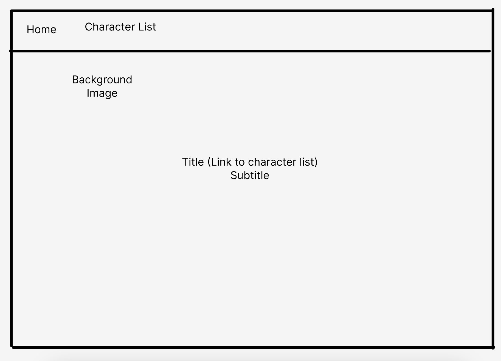
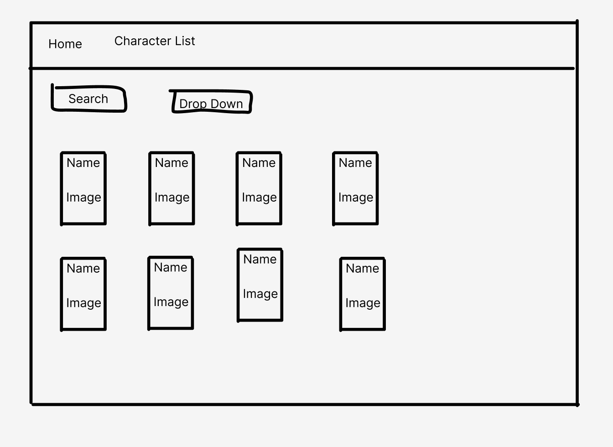
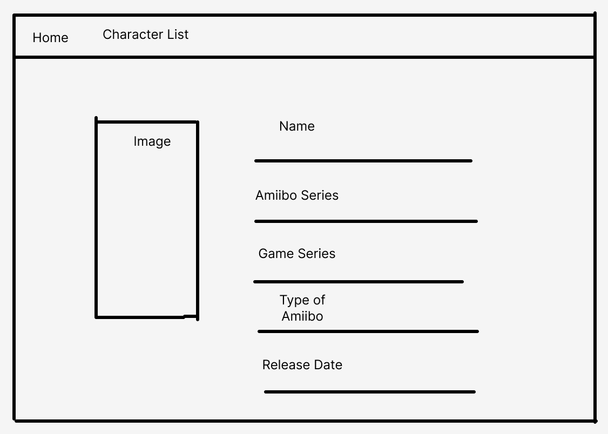
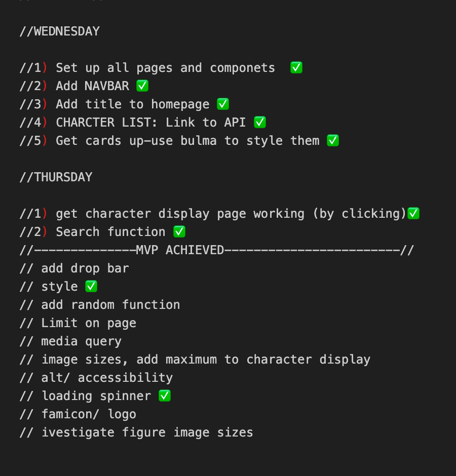
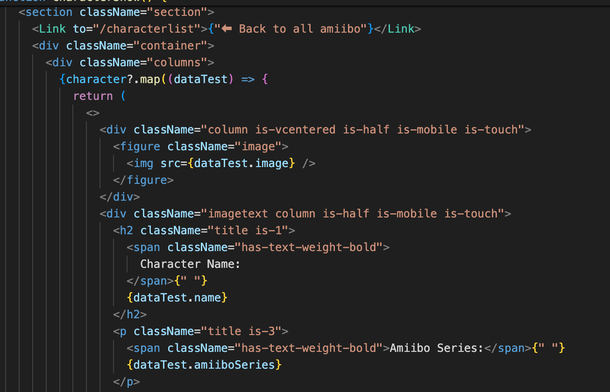
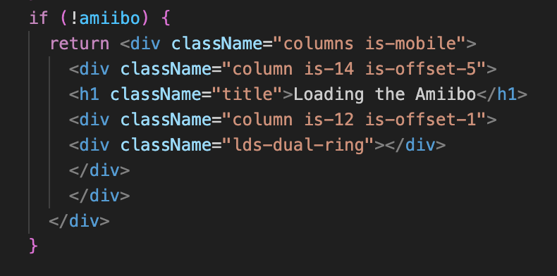

# Project 2 - Find an Amiibo

## Description

Was given the task to create a muiltipage app from a public API of our choice. We have been learning react over the last couple of weeks and this porject was used to bring the skills we have learnt together.
It was decided to use the AmiiboAPI from https://www.amiiboapi.com/

## Deployment Link

[Find Amiibo](https://main--chic-hamster-878f6b.netlify.app/)

## Getting Starter Code

To get this project up and running on your local machine, follow these steps:

1. Clone the repository: git clone git.github.com: hoenigma/seb-project-2.git
2. Install the packages: npm i
3. Run the project: npm run dev

## Timeframe & Working Team

For this project, I had the pleasure of working with Michael Broadbent and we had just under 2 days to complete this project. Below is a link to Michael's github repo:
https://github.com/MBroadbent95/seb-project-2
This project was created by pair-coding. We took it in turns for one person to write the code and one person to guide the other and provide help for any problems that arise

## Technologies Used

- React
- Bulma
- Amiibo API (https://www.amiiboapi.com/)

## Brief

The task was to use a public API of our choosing and create a multipage app that shows the data in a user-friendly way.

- The Technical Requirements for this project are the following:
- Consume a public API – this could be anything but it must make sense for your project.
- The app should include a router - with several "pages".
- Include wireframes - that you designed before building the app.
- Have semantically clean HTML - you make sure you write HTML that makes structural sense rather than thinking about how it might look, which is the job of CSS.
- Be deployed online and accessible to the public.

The Necessary deliverables for this project are:

- A working application, hosted somewhere on the internet
- A link to your hosted working app in the URL section of your Github repo
- A git repository hosted on Github, with a link to your hosted project, and frequent commits dating back to the very beginning of the project
- A readme.md file with:
  - Explanations of the technologies used
    - A couple of paragraphs about the general approach you took
    - Installation instructions for any dependencies
    - Link to your wireframes – sketches of major views / interfaces in your application
  - Descriptions of any unsolved problems or major hurdles your team had to overcome

## Planning

We started by created a wire frame of what we want the app to look like. This would be 3 seperate pages:

**Home Page:**

**Character List Page:**

**Character Show Page:**

We then made pseudocode saying what is needed for each page. This included what pages were linked, functions, data from the api and an idea of the style.
After this a Roadmap was created to make sure we were keeping on track over the 2 days.

**Road Map:**

## Build Process

The start of the process was creating each component and setting up some boiler plate for each of them.
In the App.tsx the BrowserRouter was imported and the links to the Home component and CharacterList component were giving routes.

### Navbar:

The Navbar was created first as it will go on each page so the other components will need to be designed to include the Navbar. Using Bulma we followed the framework for making a Navbar and included a logo, link to home page and link to the character list page.

![Navbar] (Images-ReadMe/Navbar.png)

### Homepage:

We decided to use a Hero for the title and added a click link to go to the CharacterList page on the container.
A background was added through the CSS and the container was styled with a hover function so the user knows where to click.

### Character List:

Firstly a useState was created to store and show the data.
Then the data was received from the API using a fetch function
To get the data from the array to display, the data had to be targeted by data.amiibo. This was worked out by using console logs to see how one character's information can be displayed and then applying it to the CharacterList function.

![Getting-data-from-API] (Images-ReadMe/Fetch-api.png)

On the character list, we wanted the information to show the name and image which led to creating the CharacterThumbnail component.

The search function was added to help the user search for a certain character on the page.
We achieved this by filtering the data from the API to only show those which matched the value put into the search bar.

We started by creating another useState value. The setSearch is giving the value from the handle change function (see image below)

![Search-function] (Images-ReadMe/Search-filter2.png)

This function is saying the value of set search will be the value typed into the input (the search bar)

We then added the filter function to get the search bar to show the characters that match the value (letters in the search bar). This was then put into the JSX and given the function .map so it would look through all the data on the API and return the values we want.

For the style, we decided to use columns to present this data and the example from Bulma was used to set this out.

### Character Thumbnail:

The thumbnail for the character list page was created using a card style from Bulma. The thumbnail has only the name and the image to keep a simple look for the character list page.

When a card is clicked, it has a link that will take the user to another page showing more details of the character clicked.
This was achieved by adding a link to the class of columns which linked to CharacterShow/${name} to target the name of the character.

### Character Show:

The data from the API was fetched in the same way we did in the Character List component and then we added the specific name of the character (&name=${name}).

For this page the information that will be on show is:

- Character Name
- Amiibo Series the character is from
- Game Series the character originates from
- Type of Amiibo, amiibo has multiple variations including figure and cards.
- Region Release Date, showing the date released from 4 regions.

## Challenges

Fetching the data at first was challenging due to the object being amiibo followed by an array of data. We haven't seen this type of data so had to think how to target it in a situation we were familiar with. This was overcomed by using .amiibo in the fetch function.

Another challenge was using the Bulma framework for our styling as we only learnt about Bulma/CSS frameworks a few days before the project. The biggest challenge was learning what words were needed to get the styling and how to nest the classes. If you had one class missing it could completely change how the page looked. This was overcomed by using google and seeing how other people with similar problems solved this, we also asked some of our colleagues how they would organise the styling.

During the deployment of our project, we had issues with the images from the search bar and background showing up on the website. This was solved by importing our images using import “image” from “path to image” and creating a new file called index.d.ts which contained a declare module for both jpeg and png.

## Wins

Adding the spinner to the application was a real achievement for the project. Having this in to make the styling feel complete and produce something that would be seen on other websites.

Working in a pair with Michael and achieving our end product was a great achievement. From the start, we had a clear idea of what to do and how to achieve it in the time frame we had. This was helped by creating the road map at the start to help structure our coding and made sure we achieved MVP and not get distracted by less important parts of the project. Working with Michael helped me see how he would solve problems and showed me a great way of planning code for future projects.

The end result was a user-friendly well presented app using React. I am very proud of what is achieved and feel like I will be able to use what I learnt here in future projects.

## Key Learning

- Bringing together what I've learnt from React over the last couple of weeks.
- Using a CSS Framework.
- How to deploy on a 3rd party website.
- Became more comfortable working in a pair and doing pair coding. It helped with my communication - skills and speaking to someone at parts I didn’t understand as well.

## Bugs

Characters that have variants or a similar name (e.g. cloud and cloud player 2 or mario/dr mario,) have a second image. This is because in the API, when fetching the name, it includes all characters that have the name in the URL. To fix this, I would need to see if the data can target just what is typed in the name for the fetch function.

Another bug was the Image aspect ratio. The images stored within the API vary in size and we were not able to come up with a solution to lock the displayed image size before deployment. Something we could try is to see if we could set a size to the images.

## Future Improvements

EExtend to include all amiibo from the API. The API had characters from Animal crossing, Legend of Zelda etc. which weren;t on Super Smash Bros. WIth more time we would add these characters in.

It would also be great to add a filter function that would include searching by game series using a drop down menu.

Something fun to add would be a random amiibo button, which when clicked on the navbar would give you random character details.
